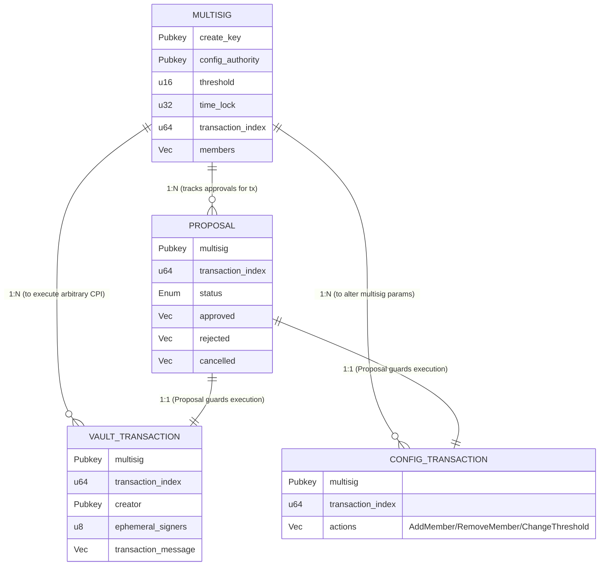

# Полный разбор структуры Multisig (на примере Squads V4)

В этом руководстве мы разберем архитектуру профессионального мультисиг-провайдера на Solana (Squads V4), поймем, как он работает под капотом, и напишем свой собственный упрощенный мультисиг на фреймворке Anchor.

## 1. Структура проекта Squads V4

Проект `squads_multisig_program` имеет классическую для крупных Anchor-программ структуру. В папке `src` логика разделена по модулям:

- `state/` — содержит структуры данных (Accounts), которые хранятся в блокчейне. Это основа архитектуры.
- `instructions/` — содержит обработчики (handlers) для каждой инструкции, которую можно вызвать в программе. Разделение по одному файлу на инструкцию.
- `errors.rs` — пользовательские ошибки контракта.
- `utils/` — вспомогательные функции, например, логика аллокации памяти.
- `lib.rs` — точка входа (entrypoint), макросы Anchor `#[program]`, роутинг к инструкциям.

### Схема архитектуры (State Schema)

Главная особенность V4 заключается в разделении состояния на несколько независимых аккаунтов. Это решает проблему ограничения размера одного аккаунта (в Solana максимум 10MB, но для CPI и транзакций выгоднее использовать маленькие аккаунты).



## 2. Как работает профессиональный Multisig (Squads)

Жизненный цикл любой транзакции проходит через следующие этапы:

1. **Создание Транзакции (Create Transaction)**
   Любой участник с правом `Initiate` создает аккаунт `VaultTransaction` (или `ConfigTransaction`). В этот момент записывается полезная нагрузка: какие инструкции нужно выполнить от имени мультисига. Индекс транзакции `transaction_index` инкрементируется в объекте `Multisig`.
2. **Создание Пропоузала (Create Proposal)**
   Создается аккаунт `Proposal` с тем же индексом. Он изначально имеет статус `Draft` или `Active`.
3. **Голосование (Voting)**
   Участники с правом `Vote` вызывают инструкцию `proposal_vote` (approve / reject / cancel). Их ключи добавляются в соответствующие массивы внутри `Proposal`. Как только массив `approved` достигает значения `threshold`, статус меняется на `Approved`.
4. **Исполнение (Execution)**
   Любой участник с правом `Execute` вызывает `vault_transaction_execute`. В этот момент проверяется, что статус предложения `Approved` и прошел `time_lock` (если установлен). Программа через механизм PDA (Program Derived Address) ставит подписи от имени мультисига и выполняет инструкции (через CPI), заложенные в `VaultTransaction`.

## 3. Как самому написать базовый Multisig Wallet на Anchor

Давайте напишем упрощенную версию. Наш Multisig будет хранить транзакцию и собирать подписи. Когда подписей достаточно, транзакция исполняется.

### Шаг 1: Описываем State (Состояние)

```rust
use anchor_lang::prelude::*;
use anchor_lang::solana_program::instruction::Instruction;

declare_id!("MyMu1tisigProgram11111111111111111111111111");

#[program]
pub mod my_multisig {
    use super::*;

    // Сюда добавим инструкции позже
}

// 1. Аккаунт самого мультисига
#[account]
pub struct Multisig {
    pub owners: Vec<Pubkey>,
    pub threshold: u64,
    pub nonce: u64, // Для генерации PDA и уникальности транзакций
}

// 2. Аккаунт конкретной транзакции
#[account]
pub struct Transaction {
    pub multisig: Pubkey,
    pub program_id: Pubkey,
    pub keys: Vec<TransactionAccount>,
    pub data: Vec<u8>,
    pub signers: Vec<Pubkey>, // Кто уже подписал
    pub executed: bool,
}

// Вспомогательная структура для передачи AccountMeta
#[derive(AnchorSerialize, AnchorDeserialize, Clone)]
pub struct TransactionAccount {
    pub pubkey: Pubkey,
    pub is_signer: bool,
    pub is_writable: bool,
}
```

### Шаг 2: Реализация инструкций

Добавляем логику внутрь `#[program]`:

```rust
#[program]
pub mod my_multisig {
    use super::*;

    // 1. Инициализация мультисига
    pub fn create_multisig(
        ctx: Context<CreateMultisig>, 
        owners: Vec<Pubkey>, 
        threshold: u64
    ) -> Result<()> {
        let multisig = &mut ctx.accounts.multisig;
        require!(owners.len() > 0, MultisigError::InvalidOwners);
        require!(threshold > 0 && threshold <= owners.len() as u64, MultisigError::InvalidThreshold);

        multisig.owners = owners;
        multisig.threshold = threshold;
        multisig.nonce = 0;
        Ok(())
    }

    // 2. Создание транзакции (предложение)
    pub fn create_transaction(
        ctx: Context<CreateTransaction>,
        program_id: Pubkey,
        keys: Vec<TransactionAccount>,
        data: Vec<u8>,
    ) -> Result<()> {
        let multisig = &mut ctx.accounts.multisig;
        let tx = &mut ctx.accounts.transaction;

        tx.multisig = multisig.key();
        tx.program_id = program_id;
        tx.keys = keys;
        tx.data = data;
        tx.signers = Vec::new();
        tx.executed = false;

        multisig.nonce += 1;
        Ok(())
    }

    // 3. Одобрение транзакции (Approve)
    pub fn approve(ctx: Context<Approve>) -> Result<()> {
        let tx = &mut ctx.accounts.transaction;
        let owner = ctx.accounts.owner.key();

        // Проверяем, что подписывающий является владельцем
        require!(ctx.accounts.multisig.owners.contains(&owner), MultisigError::NotAnOwner);
        
        // Проверяем, что он еще не подписал
        require!(!tx.signers.contains(&owner), MultisigError::AlreadyApproved);

        tx.signers.push(owner);
        Ok(())
    }

    // 4. Исполнение транзакции (Execute)
    pub fn execute_transaction(ctx: Context<ExecuteTransaction>) -> Result<()> {
        let tx = &mut ctx.accounts.transaction;
        let multisig = &ctx.accounts.multisig;

        require!(!tx.executed, MultisigError::AlreadyExecuted);
        require!(tx.signers.len() as u64 >= multisig.threshold, MultisigError::NotEnoughSigners);

        // Собираем AccountMeta для CPI (Cross-Program Invocation)
        let mut account_metas = Vec::new();
        for acc in &tx.keys {
            account_metas.push(if acc.is_writable {
                AccountMeta::new(acc.pubkey, acc.is_signer)
            } else {
                AccountMeta::new_readonly(acc.pubkey, acc.is_signer)
            });
        }

        let ix = Instruction {
            program_id: tx.program_id,
            accounts: account_metas,
            data: tx.data.clone(),
        };

        // PDA подпись от имени мультисига (если мультисиг должен быть signer)
        let bump = ctx.bumps.multisig_signer;
        let seeds = &[b"multisig_signer", multisig.to_account_info().key.as_ref(), &[bump]];
        let signer = &[&seeds[..]];

        // Выполняем инструкцию
        anchor_lang::solana_program::program::invoke_signed(
            &ix,
            ctx.remaining_accounts,
            signer,
        )?;

        tx.executed = true;
        Ok(())
    }
}
```

### Шаг 3: Структуры Context (Валидация аккаунтов)

К каждой инструкции нужно написать набор правил (Constraints) для аккаунтов:

```rust
#[derive(Accounts)]
pub struct CreateMultisig<'info> {
    #[account(init, payer = payer, space = 8 + 32 * 10 + 8 + 8)] // Грубый расчет места
    pub multisig: Account<'info, Multisig>,
    #[account(mut)]
    pub payer: Signer<'info>,
    pub system_program: Program<'info, System>,
}

#[derive(Accounts)]
pub struct CreateTransaction<'info> {
    #[account(mut)]
    pub multisig: Account<'info, Multisig>,
    #[account(init, payer = proposer, space = 1000)] // Размер зависит от размера data транзакции
    pub transaction: Account<'info, Transaction>,
    #[account(mut)]
    pub proposer: Signer<'info>, // инициатор должен платить за rent
    pub system_program: Program<'info, System>,
}

#[derive(Accounts)]
pub struct Approve<'info> {
    pub multisig: Account<'info, Multisig>,
    #[account(mut, has_one = multisig)]
    pub transaction: Account<'info, Transaction>,
    pub owner: Signer<'info>, // Подписывающий обязан поставить криптографическую подпись
}

#[derive(Accounts)]
pub struct ExecuteTransaction<'info> {
    pub multisig: Account<'info, Multisig>,
    /// CHECK: Это PDA, от имени которого подписывает мультисиг
    #[account(seeds = [b"multisig_signer", multisig.key().as_ref()], bump)]
    pub multisig_signer: UncheckedAccount<'info>,
    #[account(mut, has_one = multisig)]
    pub transaction: Account<'info, Transaction>,
}

#[error_code]
pub enum MultisigError {
    #[msg("Invalid Owners")]
    InvalidOwners,
    #[msg("Invalid Threshold")]
    InvalidThreshold,
    #[msg("Not an Owner")]
    NotAnOwner,
    #[msg("Already Approved")]
    AlreadyApproved,
    #[msg("Not Enough Signers")]
    NotEnoughSigners,
    #[msg("Already Executed")]
    AlreadyExecuted,
}
```

### Почему Squads V4 сложнее?
Наш написанный Multisig рабочий, но в реальном мире, как в Squads V4:
1. **Динамическая аллокация:** Аккаунты ресайзятся через `realloc`, чтобы не тратить лишние SOL за аренду места впустую.
2. **Роли и уровни доступа:** Участники имеют маски разрешений (`Initiate`, `Vote`, `Execute`). У нас любой `owner` может создавать, голосовать и выполнять.
3. **Time Locks:** Задержка во времени между одобрением и исполнением для безопасности.
4. **Контроль размера `TransactionMessage`:** В реальном мире сложно упаковать множество инструкций в 1 аккаунт, поэтому Squads использует буферы (`TransactionBuffer`).
5. **Безопасность (Reentrancy, Stale Transactions):** Если список владельцев меняется во время голосования за какую-то транзакцию, в Squads старые транзакции становятся "stale" (недействительными) через инкремент индекса конфигурации.

Это фундаментальная логика, на основе которой строятся любые децентрализованные DAO и мультисиги на блокчейне Solana.
